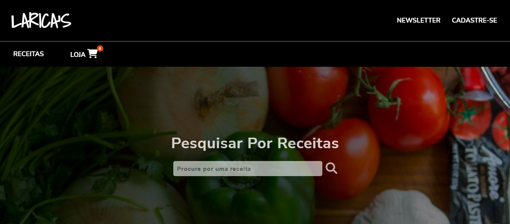

# LARICA'S 
 

Projeto de um site de receitas fictício, onde o usuário teria acesso a receitas e também acesso a uma loja para compra de ingredientes e utensílios.
 

## Tecnologias
 
Desenvolido com HTML e Css para estrura e JavaScript para interações, como por exemplo a abertura e fechamento da MODAL;

## Próximas etapas
[ ] Aplicar validação para o formulário de cadastro;
 
[ ] Melhorar a responsividade;
 
[ ] Criar um carrossel para os cards das receitas;
 

** Serão adicionadas mais tarefas conforme idéias forem surgindo
